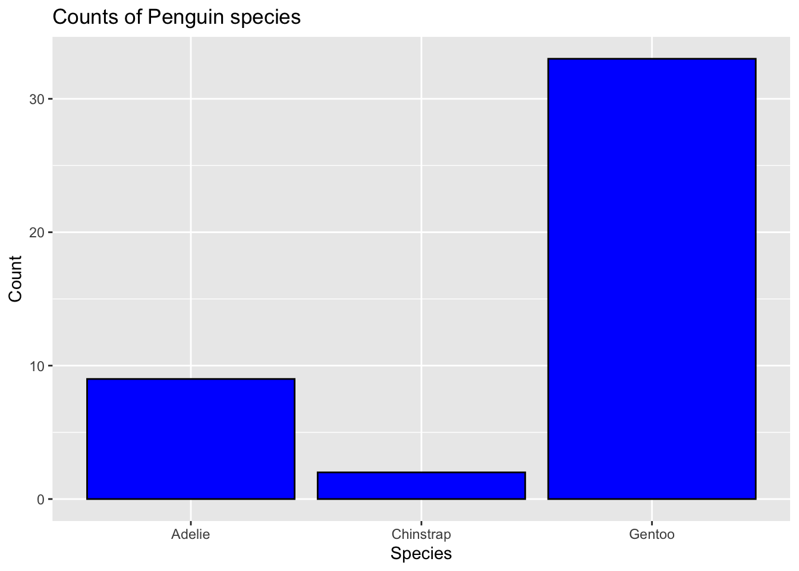
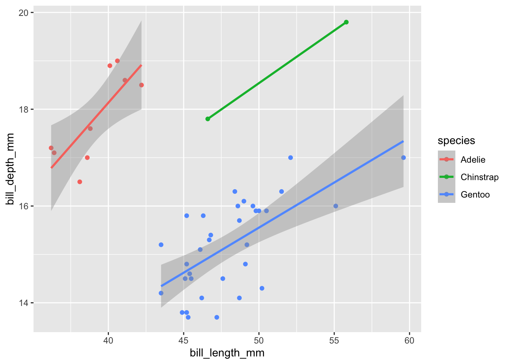

## Palmer Penguin Analysis

This is an analysis of Palmer's Penguin dataset.

## **Loading Packages and Datasets**

Here we will load the tidyverse package and penguins data.


::: {.cell}

```{.r .cell-code}
#Load the tidyverse
library(tidyverse)
```

::: {.cell-output .cell-output-stderr}
```
── Attaching packages ─────────────────────────────────────── tidyverse 1.3.2 ──
✔ ggplot2 3.4.0      ✔ purrr   1.0.0 
✔ tibble  3.1.8      ✔ dplyr   1.0.10
✔ tidyr   1.2.1      ✔ stringr 1.5.0 
✔ readr   2.1.3      ✔ forcats 0.5.2 
── Conflicts ────────────────────────────────────────── tidyverse_conflicts() ──
✖ dplyr::filter() masks stats::filter()
✖ dplyr::lag()    masks stats::lag()
```
:::

```{.r .cell-code}
library(kableExtra)
```

::: {.cell-output .cell-output-stderr}
```

Attaching package: 'kableExtra'

The following object is masked from 'package:dplyr':

    group_rows
```
:::

```{.r .cell-code}
#Read the penguins_samp1 data file from github
penguins <- read_csv("https://raw.githubusercontent.com/mcduryea/Intro-to-Bioinformatics/main/data/penguins_samp1.csv")
```

::: {.cell-output .cell-output-stderr}
```
Rows: 44 Columns: 8
── Column specification ────────────────────────────────────────────────────────
Delimiter: ","
chr (3): species, island, sex
dbl (5): bill_length_mm, bill_depth_mm, flipper_length_mm, body_mass_g, year

ℹ Use `spec()` to retrieve the full column specification for this data.
ℹ Specify the column types or set `show_col_types = FALSE` to quiet this message.
```
:::

```{.r .cell-code}
#See the first six rows of the data we've read in to our notebook
penguins %>% 
  head(2) %>% 
  kable() %>% 
  kable_styling(c("striped", "hover"))
```

::: {.cell-output-display}

`````{=html}
<table class="table table-striped table-hover" style="margin-left: auto; margin-right: auto;">
 <thead>
  <tr>
   <th style="text-align:left;"> species </th>
   <th style="text-align:left;"> island </th>
   <th style="text-align:right;"> bill_length_mm </th>
   <th style="text-align:right;"> bill_depth_mm </th>
   <th style="text-align:right;"> flipper_length_mm </th>
   <th style="text-align:right;"> body_mass_g </th>
   <th style="text-align:left;"> sex </th>
   <th style="text-align:right;"> year </th>
  </tr>
 </thead>
<tbody>
  <tr>
   <td style="text-align:left;"> Gentoo </td>
   <td style="text-align:left;"> Biscoe </td>
   <td style="text-align:right;"> 59.6 </td>
   <td style="text-align:right;"> 17 </td>
   <td style="text-align:right;"> 230 </td>
   <td style="text-align:right;"> 6050 </td>
   <td style="text-align:left;"> male </td>
   <td style="text-align:right;"> 2007 </td>
  </tr>
  <tr>
   <td style="text-align:left;"> Gentoo </td>
   <td style="text-align:left;"> Biscoe </td>
   <td style="text-align:right;"> 48.6 </td>
   <td style="text-align:right;"> 16 </td>
   <td style="text-align:right;"> 230 </td>
   <td style="text-align:right;"> 5800 </td>
   <td style="text-align:left;"> male </td>
   <td style="text-align:right;"> 2008 </td>
  </tr>
</tbody>
</table>

`````

:::
:::


You can add options to executable code like this


::: {.cell}
::: {.cell-output .cell-output-stdout}
```
[1] 4
```
:::
:::


The `echo: false` option disables the printing of code (only output is displayed).

## About Our Data

The data we are working with is a dataset on Penguins, which includes 8 features measured on 44 penguins. The features included are physiological features (like bill length, bill depth, flipper length, body mass, etc) ass well as other features like the year that the penguin was observed,the island the penguins was observed on, the sex of the penguin,and the species of the penguin.

## Interesting Questions to Ask

-   What is the average flipper length? What about for each species?

-   Are there more male or female penguins? What about per island or species?

-   What is the average body mass? What about by island? By species? By sex?

-   What is the ratio of bill length to bill depth for a penguin? What is the overall average of this metric? Does it change by species, sex, or island?

-   Does average body mass change year?

## Data Manipulation Tools and Strategies

We can look at individual columns in a data set or subsets of columns in a dataset. For example, if we are only interested in flipper length and species we can `select()` those columns


::: {.cell}

```{.r .cell-code}
penguins %>%
  select(species, body_mass_g)
```

::: {.cell-output .cell-output-stdout}
```
# A tibble: 44 × 2
   species body_mass_g
   <chr>         <dbl>
 1 Gentoo         6050
 2 Gentoo         5800
 3 Gentoo         5550
 4 Gentoo         5500
 5 Gentoo         5850
 6 Gentoo         5950
 7 Gentoo         5700
 8 Gentoo         5350
 9 Gentoo         5550
10 Gentoo         6300
# … with 34 more rows
```
:::
:::


If we want to `filter()` and only show certain rows, we can do that too.


::: {.cell}

```{.r .cell-code}
penguins %>%
  filter(species == "Chinstrap")
```

::: {.cell-output .cell-output-stdout}
```
# A tibble: 2 × 8
  species   island bill_length_mm bill_depth_mm flipper_le…¹ body_…² sex    year
  <chr>     <chr>           <dbl>         <dbl>        <dbl>   <dbl> <chr> <dbl>
1 Chinstrap Dream            55.8          19.8          207    4000 male   2009
2 Chinstrap Dream            46.6          17.8          193    3800 fema…  2007
# … with abbreviated variable names ¹​flipper_length_mm, ²​body_mass_g
```
:::

```{.r .cell-code}
#We can also filter by nymerical variables
penguins %>%
  filter(body_mass_g >= 6000)
```

::: {.cell-output .cell-output-stdout}
```
# A tibble: 2 × 8
  species island bill_length_mm bill_depth_mm flipper_leng…¹ body_…² sex    year
  <chr>   <chr>           <dbl>         <dbl>          <dbl>   <dbl> <chr> <dbl>
1 Gentoo  Biscoe           59.6          17              230    6050 male   2007
2 Gentoo  Biscoe           49.2          15.2            221    6300 male   2007
# … with abbreviated variable names ¹​flipper_length_mm, ²​body_mass_g
```
:::

```{.r .cell-code}
#We can also do both
 penguins %>%
   filter((body_mass_g >= 6000) | (island == "Torgersen"))
```

::: {.cell-output .cell-output-stdout}
```
# A tibble: 7 × 8
  species island    bill_length_mm bill_depth_mm flipper_l…¹ body_…² sex    year
  <chr>   <chr>              <dbl>         <dbl>       <dbl>   <dbl> <chr> <dbl>
1 Gentoo  Biscoe              59.6          17           230    6050 male   2007
2 Gentoo  Biscoe              49.2          15.2         221    6300 male   2007
3 Adelie  Torgersen           40.6          19           199    4000 male   2009
4 Adelie  Torgersen           38.8          17.6         191    3275 fema…  2009
5 Adelie  Torgersen           41.1          18.6         189    3325 male   2009
6 Adelie  Torgersen           38.6          17           188    2900 fema…  2009
7 Adelie  Torgersen           36.2          17.2         187    3150 fema…  2009
# … with abbreviated variable names ¹​flipper_length_mm, ²​body_mass_g
```
:::
:::


## Answering Our Questions

Most of our questions involve summarizing data, and perhaps summarizing over groups. We can summarize data using the `summarize()` functions, and data group using `group_by()`.

Let's find the average flipper length.


::: {.cell}

```{.r .cell-code}
#Overall average flipper length
penguins %>% 
  summarize(avg_flipper_length = mean(flipper_length_mm))
```

::: {.cell-output .cell-output-stdout}
```
# A tibble: 1 × 1
  avg_flipper_length
               <dbl>
1               212.
```
:::

```{.r .cell-code}
penguins %>%
  filter(species == "Gentoo") %>%
  summarize(avg_flipper_length = mean(flipper_length_mm))
```

::: {.cell-output .cell-output-stdout}
```
# A tibble: 1 × 1
  avg_flipper_length
               <dbl>
1               218.
```
:::

```{.r .cell-code}
#Grouped Average
penguins %>%
  group_by(species) %>%
  summarize(av_flipper_length = mean(flipper_length_mm))
```

::: {.cell-output .cell-output-stdout}
```
# A tibble: 3 × 2
  species   av_flipper_length
  <chr>                 <dbl>
1 Adelie                 189.
2 Chinstrap              200 
3 Gentoo                 218.
```
:::
:::


How many of each species do we have?


::: {.cell}

```{.r .cell-code}
penguins %>%
  count(species)
```

::: {.cell-output .cell-output-stdout}
```
# A tibble: 3 × 2
  species       n
  <chr>     <int>
1 Adelie        9
2 Chinstrap     2
3 Gentoo       33
```
:::
:::


How many of each sex are there? What about island or species?


::: {.cell}

```{.r .cell-code}
penguins %>%
 count(sex)
```

::: {.cell-output .cell-output-stdout}
```
# A tibble: 2 × 2
  sex        n
  <chr>  <int>
1 female    20
2 male      24
```
:::

```{.r .cell-code}
penguins %>%
  group_by(species) %>%
  count(sex)
```

::: {.cell-output .cell-output-stdout}
```
# A tibble: 6 × 3
# Groups:   species [3]
  species   sex        n
  <chr>     <chr>  <int>
1 Adelie    female     6
2 Adelie    male       3
3 Chinstrap female     1
4 Chinstrap male       1
5 Gentoo    female    13
6 Gentoo    male      20
```
:::
:::


We can `mutate()` to add new columns to our data set


::: {.cell}

```{.r .cell-code}
penguins_with_ratio <- penguins %>%
  mutate(bill_ltd_ratio = bill_length_mm / bill_depth_mm)

#Average Ratio
penguins %>%
  mutate(bill_ltd_ratio = bill_length_mm / bill_depth_mm) %>%
  summarize(mean_bill_ltd_ratio = mean (bill_ltd_ratio),
            median_bill_ltd_ratio = median(bill_ltd_ratio))
```

::: {.cell-output .cell-output-stdout}
```
# A tibble: 1 × 2
  mean_bill_ltd_ratio median_bill_ltd_ratio
                <dbl>                 <dbl>
1                2.95                  3.06
```
:::

```{.r .cell-code}
#Average Ratio by Group
penguins %>%
  group_by(species) %>%
  mutate(bill_ltd_ratio = bill_length_mm / bill_depth_mm) %>%
  summarize(mean_bill_ltd_ratio = mean (bill_ltd_ratio),
            median_bill_ltd_ratio = median(bill_ltd_ratio))
```

::: {.cell-output .cell-output-stdout}
```
# A tibble: 3 × 3
  species   mean_bill_ltd_ratio median_bill_ltd_ratio
  <chr>                   <dbl>                 <dbl>
1 Adelie                   2.20                  2.20
2 Chinstrap                2.72                  2.72
3 Gentoo                   3.17                  3.13
```
:::
:::


Average body mass by year


::: {.cell}

```{.r .cell-code}
penguins %>%
  group_by(year) %>%
  summarize(mean_body_mass = mean(body_mass_g))
```

::: {.cell-output .cell-output-stdout}
```
# A tibble: 3 × 2
   year mean_body_mass
  <dbl>          <dbl>
1  2007          5079.
2  2008          4929.
3  2009          4518.
```
:::
:::


## Data Visualization: 

-   What is the distribution of penguins flipper lengths? numerical

-   What is the distribution of penguin species? categorical

-   Does the distribution of flipper length depend of the species of penguins?

-   How does bill length change throughout the years

-   Is there any correlation between the bill length and bill depth? scatterplot


::: {.cell}

```{.r .cell-code}
penguins %>%
  ggplot () +
  geom_histogram( aes(x = flipper_length_mm), 
                  bins = 15, 
                  fill = "skyblue",
                  color = "red") +
  labs(title = "Distribution of Flipper length (mm)",
       subtitle = "Mean in Black, Median in Orange",
       y = "", x = "Flipper length (mm)") +
         geom_vline(aes (xintercept = mean (flipper_length_mm)), lwd = 2, lty = "dashed" ) +
          geom_vline(aes (xintercept = median (flipper_length_mm)),color = "orange", lwd = 2, lty = "dotted")
```

::: {.cell-output .cell-output-stderr}
```
Warning: Using `size` aesthetic for lines was deprecated in ggplot2 3.4.0.
ℹ Please use `linewidth` instead.
```
:::

::: {.cell-output-display}
{width=672}
:::
:::


Categorical Plot


::: {.cell}

```{.r .cell-code}
penguins %>%
  ggplot() +
  geom_bar(mapping = aes(x = species ), color = "black", fill="blue") +
  labs(title =  "Counts of Penguin species",
       x = "Species", y = "Count")
```

::: {.cell-output-display}
{width=672}
:::
:::


Let's make a scatter plot see if bill legnth is correlated with bill depth


::: {.cell}

```{.r .cell-code}
penguins %>%
  ggplot() +
  geom_point(aes(x = bill_length_mm, y = bill_depth_mm, color = species)) +
  geom_smooth(aes(x =bill_length_mm, y = bill_depth_mm, color = species), method = "lm")
```

::: {.cell-output .cell-output-stderr}
```
`geom_smooth()` using formula = 'y ~ x'
```
:::

::: {.cell-output .cell-output-stderr}
```
Warning in qt((1 - level)/2, df): NaNs produced
```
:::

::: {.cell-output .cell-output-stderr}
```
Warning in max(ids, na.rm = TRUE): no non-missing arguments to max; returning
-Inf
```
:::

::: {.cell-output-display}
{width=672}
:::
:::
